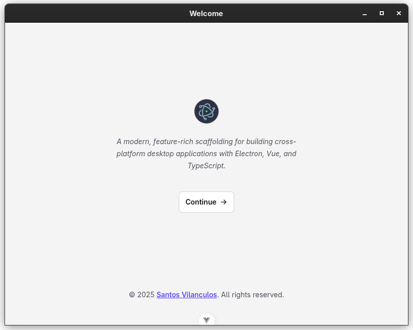
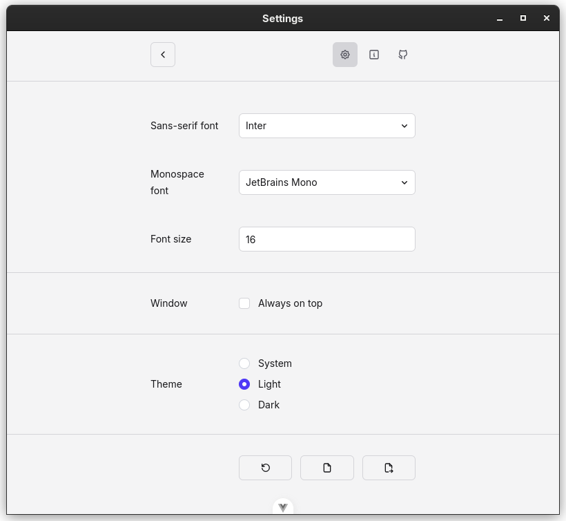
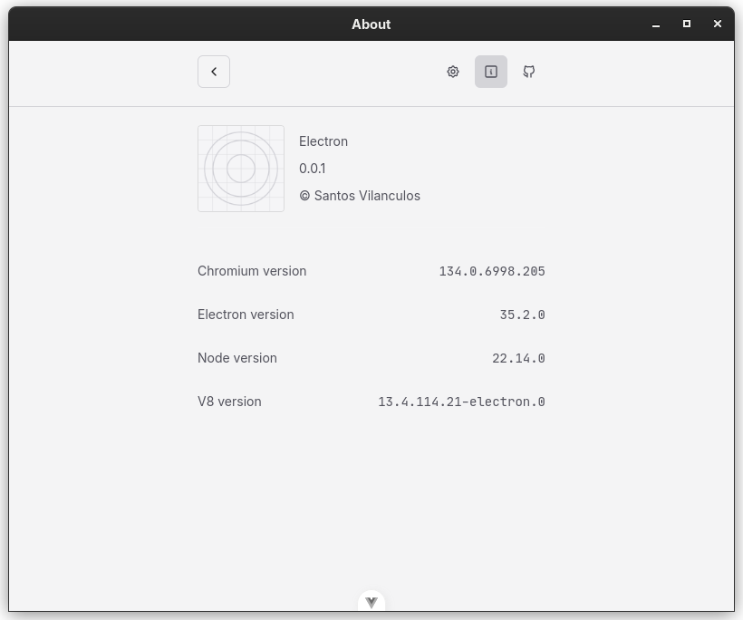

[](https://github.com/SantosVilanculos/electron/blob/main/LICENSE)





## Introduction

A modern, feature-rich scaffolding for building cross-platform desktop applications with Electron, Vue, and TypeScript.

## Features

- Typescript typed codebase
- One command required to get started developing
- Linux, Mac and Window releace build process and GitHub CI releace workflow
- Fully context exolated main and renderer process
- Custom exposed api on renderer process for operations and information retrival
- Real time, extensable and externally manipulable Key-Value pair configuration:

  - Font family
  - Font Size
  - Window state (Always on top)
  - Color Scheme (Light/Dark)

## Get started

### Cloning the repository

```sh
git clone https://github.com/santosvilanculos/electron.git your-project-name
cd your-project-name
npm install
```

### Using the installer

```sh
npm create electron-app
```

## Usage

### Development

```sh
npm run dev
```

### Release build

```sh
npm run package
```
